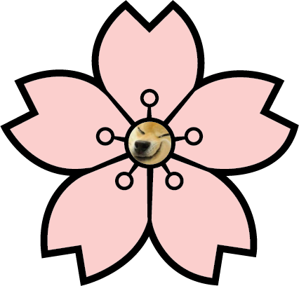

# OurAnimeList

**OurAnimeList is a web application for discovering and tracking anime.**

*This project is heavily inspired by:* [MyAnimeList](https://myanimelist.net/)

## Built With
- [NodeJS](https://github.com/nodejs/node)
- [Node Wrapper for MAL API](https://github.com/Chris-Kode/myanimelist-api-v2)
- [React](https://github.com/facebook/react/)
- [Create React App](https://github.com/facebook/create-react-app)

## Additional Packages
- [Axios](https://github.com/axios/axios)
- [ExpressJS](https://github.com/expressjs/express)
- [React-Bootstrap](https://github.com/react-bootstrap/react-bootstrap)
- [Nodemon](https://github.com/remy/nodemon)
- [Dotenv](https://github.com/motdotla/dotenv)
- ~~[AWS SDK for JavaScript](https://github.com/aws/aws-sdk-js-v3)~~

## Links
[MAL API](https://myanimelist.net/apiconfig/references/api/v2)

# Documentation

## How To Run This Project
1. clone the repo `git clone https://github.com/DogeSmirkers/react-ouranimelist.git`
2. install all neccessary packages for front-end `cd /react-ouranimelist/client && npm i`
3. install all neccessary packages for back-end `cd /react-ouranimelist/server && npm i`
4. start the back-end first `cd /react-ouranimelist/server && npm start` or `nodemon start`
5. start the front-end `cd /react-ouranimelist/client && npm start`

## Additional Notes
A `.env` file that contains the `CLIENT_ID` must be created in `server/`. You can obtain your own Client ID, which is basically an API token, by creating a MyAnimeList account and requesting access to the API. It's in Account Settings > [API](https://myanimelist.net/apiconfig) 

(CIT480 Senior Design Project: fall 2021 - spring 2022)
